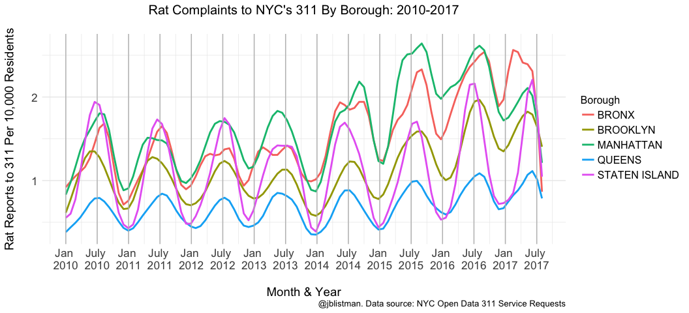

NYC311rats\_animated\_map
================
Jenny
1/12/2018

Load packages used

``` r
library(tidyverse)
library(data.table)
```

I previously downloaded [NYC 311 data on rat and mouse sightings](https://data.cityofnewyork.us/Social-Services/Rat-and-Mouse-Sightings/tyjc-9rwy?category=Social-Services&view_name=Rat-and-Mouse-Sightings) using filter criteria Descriptor = "Rat Sighting or Mouse Sighting".

This results in a large data set with many variables not needed for this project. The data set was processed in R to retain 4 of 53 variables (Incident Zip, Created Date, Descriptor, Borough), change character variables to factor, remove spaces from variable names, filtered to remove mouse sightings, date changed to POSIXct format, and additional Year, Month, and Month\_Year variables created. Data were saved as RatData.rds and are in this Github repository.

Read in RatData.rds and census data NYCpopsizebyzip.csv (also in this repository) for popoulation size by NYC zip code. Add population count (NYCpopsizebyzip$value) to RatData by matching zip codes. region variable in NYCpopsizebyzip must be changed from numeric to factor varialbe in order to use `base::merge`. Use `droplevels` to remove Incident\_Zip and Borough typos, NAs, or errors from NYC 311 database. Rename population count variable to be self-explanatory.

``` r
RatData <- readRDS("RatData.rds")

NYCpopsizebyzip <- read.csv("NYCpopsizebyzip.csv", header=TRUE)

NYCpopsizebyzip$region <- as.factor(NYCpopsizebyzip$region)

RatData <- RatData %>%
        merge(NYCpopsizebyzip, by.x="Incident_Zip", by.y="region") %>%
         rename("popsize" = value) %>%
        droplevels()
```

Make a tidy Zip dataframe including new variable of calls per Month\_Year by zip code with `dplyr::count`. Rename the newly created variable to be self-explanatory.

``` r
TidyRatDataZip <- RatData %>% 
        count(Incident_Zip, popsize, Month_Year) %>%
        rename("count_calls_Zip" = n)
```

For mapping with `choroplethrZip`, factor variable must be named "value" and needs labels for legend. Zip needs to be named "region" for choroplethrZip.

For mapping, it can be more useful to compare relative instead of absolute counts across regions. Make new variables based on rat reports per population count. First make a numeric variable of rat reports per zip code population size, then bin it to create a factor variable which will be used as the mapped "value" in `choroplethrZip`.

Visually inspect the distribution of the factor variable to be mapped onto zip codes by printing a table.

``` r
TidyRatDataZip <-  TidyRatDataZip %>%
        mutate(ReportPer10K = (count_calls_Zip/popsize)*10000) %>%
        mutate(value = cut(ReportPer10K,
                                     breaks = c(0.09,0.35,0.55, 0.8, 1.1, 1.5, 2.0,3,10,41), 
                                     labels = c("0.09-0.35","0.35-0.55","0.55-0.80","0.80-1.10","1.10-1.50","1.50-2.00", "2.00-3.00","3.00-10.00","10.00-41.00"))) %>%
        mutate(region = Incident_Zip)

table(TidyRatDataZip$value)
```

    ## 
    ##   0.09-0.35   0.35-0.55   0.55-0.80   0.80-1.10   1.10-1.50   1.50-2.00 
    ##        1721        1651        1605        1603        1751        1610 
    ##   2.00-3.00  3.00-10.00 10.00-41.00 
    ##        1791        1476          57

Make a smoothed line plot of median call density per Month\_Year across all zips within each Borough to show seasonality.

Create new data frame with Month\_Year in proper order for plotting & create median variable.

``` r
RatCallsByBoroughMedian <- RatData %>% 
        count(Incident_Zip, Borough, popsize, Month_Year) %>%
        rename("count_calls_Zip" = n) %>%
        mutate(ReportPer10K = (count_calls_Zip/popsize)*10000) %>%
        group_by(Borough, Month_Year) %>%
        summarize(MedianMonthYearReportPer10K = median(ReportPer10K))
```

Create a dummy variable, "Order", to make plotting the x-axis easier. "Order" is a number from 1 to 92, which is the number of levels for the factor variable "Month\_Year". Change names of "Order" variable manually for x-axis using only January and July so x-axis is readable instead of crowded and seasonality is visible. The `\n` within each xlabel makes them print on two lines instead of a single, unreadable line.

``` r
RatCallsByBoroughMedian$Order <- seq_along(1:92) 
xlabels <- c("Jan \n2010","July \n2010","Jan \n2011","July \n2011","Jan \n2012",
            "July \n2012","Jan \n2013","July \n2013","Jan \n2014","July \n2014",
            "Jan \n2015","July \n2015","Jan \n2016","July \n2016","Jan \n2017","July \n2017")
```

Make lineplot graph

``` r
RatCallsByMonthBorough <- ggplot(RatCallsByBoroughMedian,aes(Order, MedianMonthYearReportPer10K)) +
        geom_smooth(aes(group=Borough, color=Borough), na.rm = TRUE, 
                    formula = y ~ s(x, k = 50), method = "gam", n= 100, se = FALSE)+
        theme_minimal() +
        xlab("\nMonth & Year") + 
        ylab("Rat Reports to 311 Per 10,000 Residents\n") + 
        labs(title="Rat Complaints to NYC's 311 By Borough: 2010-2017\n", 
             caption="@jblistman. Data source: NYC Open Data 311 Service Requests") +
        scale_y_continuous(breaks=c(0,1,2,3), labels= c("0","1","2","3")) +
        geom_vline(xintercept=seq(1,92,by=6), colour='gray') + ## used theme_minimal to get rid of lots of lines - geom_vline will re-insert vertical lines only at January & July axis ticks for a cleaner look
        scale_x_continuous(breaks=seq(1,92,by=6),labels=xlabels) + ## label only Jan & July axis ticks for a cleaner look
        theme(axis.text.x=element_text(size = 13), 
              axis.text.y=element_text(size = 13),
              axis.title.x=element_text (size = 14),
              axis.title.y=element_text (size = 14),
              plot.title = element_text(size = 15, hjust = 0.5),
              legend.text = element_text(size = 12),
              legend.title = element_text(size = 12))

RatCallsByMonthBorough
```



Load packages needed for mapping and gif

``` r
library(gganimate)
library(choroplethr)
library(choroplethrZip)
library(magick)
library(filesstrings)
```

Make dataframe with variables needed for map

``` r
TidyRatMapData <- TidyRatDataZip[,c(3,4,6,7)]
```

Create objects and order variables needed for maps. 1. Month\_Year as list in chronologicall order.
2. Make vector of color-blind friendly map color palette derived from [colorbrewer website](http://colorbrewer2.org/#type=sequential&scheme=YlGnBu&n=9) for 9 factor levels of "value".
3. Make vector of NYC zip codes instead of using nyc\_fips because county fips codes include some census zcta (close to zip codes, but not exactly) that include Long Island, which is *definitely* not part of NYC.

``` r
datesRats <- sort(unique(TidyRatMapData$Month_Year))
mapcolors <- c('#ffffd9','#edf8b1','#c7e9b4','#7fcdbb','#41b6c4','#1d91c0','#225ea8','#253494','#081d58')
nyc_zips <- NYCpopsizebyzip$region
```

Make maps using `zip_choropleth` which uses `ggplot2` to make map objects and then `choroplethr_animate` to write map png files.
These pngs can be used as-is with `choroplethr_animate` which creates code along with the pngs to make a link to animated maps or they can be turned into a gif with `magick`.

For each Month\_Year create a map. This code was adapted from a [tutorial by Kimberly Coffey](http://www.kimberlycoffey.com/blog/2015/10/17/animated-choropleth-map-for-the-web).

``` r
RatMapsAnimate <- list()

for (i in 1:length(datesRats)) {temp.date <- datesRats[i]
df <- subset(TidyRatMapData, Month_Year == temp.date)
totalrats <- sum(df$count_calls_Zip)
title = paste("Total Rat Reports to NYC's 311 in", temp.date, ":", totalrats)
RatMapsAnimate[[i]] = zip_choropleth(df, zip_zoom = nyc_zips, title=title, reference_map=FALSE) + 
        scale_fill_manual(values=mapcolors,drop=FALSE, 
                          na.translate = TRUE, na.value = "gray",
                          name="Rat Reports to \nNYC's 311 Per \n10,000 Residents")+
        labs(caption="@jblistman. Data source: NYC Open Data 311 Service Requests")+
        scale_colour_manual(values=NA) +              
        guides(colour=guide_legend("0", override.aes=list(colour="gray")))
} 
```

Write a png image for each map plus a file with html code to combine pngs as an animation. The animation can be viewed in a browser, but we'll also turn the pngs into a gif.

``` r
choroplethr_animate(RatMapsAnimate)
```

`choroplethr_animate` creates files with numerical names that are out of order, alphabetically. Rename files choropleth\_1.png ... choropleth\_9.png to choropleth\_01.png ... choropleth\_09.png so when they are automatically turned into a gif with `magick`, they are ordered alphabetically as well as numerically.

`filestrings::nice_file_nums` will do this automatically for an entire directory. The current working directory already contains the .png files that need to be renamed.

``` r
nice_file_nums(dir = ".", pattern = ".png")
```

Convert the .png files to a .gif with ImageMagick. If you've moved the .png files, change directory before running the following code. I've named the resulting file ratmaps.gif and chose a delay of 40 between frames. Play with the delay depending on your preferences for time between frames and name your own file. `system()` executes code as if you're using the terminal.

``` r
system("convert -delay 40 *.png ratmaps.gif")
```

If you don't want to save all the gigantic .png files, remove them from the directory.

``` r
file.remove(list.files(pattern=".png"))
```
